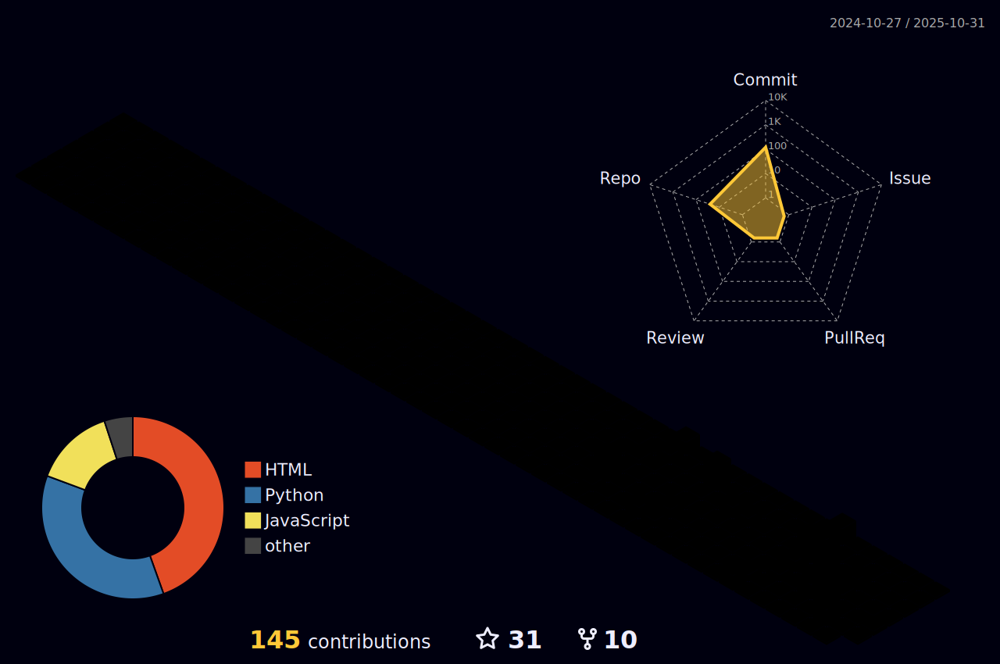

  

  

  <em>A passionate developer from Bangladesh, interested in creating beautiful and engaging user experiences. I'm always learning and exploring new technologies.</em>

  
  
  
  
  
  

## 🚀 𝙰𝚋𝚘𝚞𝚝 𝙼𝚎
I'm a self-taught developer with a passion for front-end development and creating intuitive, user-friendly interfaces. I'm currently diving deeper into the React ecosystem and exploring the world of full-stack development. My goal is to leverage my skills to build meaningful and impactful web applications.

- 🌐 Visit my website: [nahid.rf.gd](http://nahid.rf.gd/)
- 📫 How to reach me: [nahidul.live@gmail.com](mailto:nahidul.live@gmail.com)
- ⏰ My Timezone: `(GMT+6:00) Bangladesh Standard Time`

## 🛠️ 𝙼𝚢 𝚂𝚔𝚒𝚕𝚕𝚜

  <b>Languages</b>
   
  
  
  
    
  <b>Frameworks & Libraries</b>
   
  
  
  
    
  <b>Tools & Platforms</b>
   
  
  
  

## 🌱 𝙸'𝚖 𝙲𝚞𝚛𝚛𝚎𝚗𝚝𝚕𝚢 𝙻𝚎𝚊𝚛𝚗𝚒𝚗𝚐
- 💻 Next.js
- 🎨 Tailwind CSS
- ☁️ Firebase

## 📊 𝙼𝚢 𝙶𝚒𝚝𝙷𝚞𝚋 𝚂𝚝𝚊𝚝𝚜 & 𝙰𝚌𝚝𝚒𝚟𝚒𝚝𝚢

  

  

  

  <picture>
    <source media="(prefers-color-scheme: dark)" srcset="https://raw.githubusercontent.com/NotNahid/NotNahid/output/dist/github-snake-dark.svg">
    
  </picture>

  

## 📂 𝙼𝚢 𝙿𝚛𝚘𝚓𝚎𝚌𝚝𝚜 & 𝚁𝚎𝚊𝚍𝚒𝚗𝚐

  

### 📚 Currently Reading
<table>
<!-- GOODREADS-LIST:START -->
- [8 Days For Salvation](https://www.goodreads.com/review/show/8109451142?utm_medium=api&utm_source=rss) by Yolanda Olson (⭐️2.78)
- [বেগম মেরী বিশ্বাস (অখন্ড)](https://www.goodreads.com/review/show/7750263565?utm_medium=api&utm_source=rss) by বিমল মিত্র | Bimal Mitra (⭐️4.04)
- [The Illiad](https://www.goodreads.com/review/show/7680664926?utm_medium=api&utm_source=rss) by Homer (⭐️3.9)
- [ঘরে বাইরে](https://www.goodreads.com/review/show/7592712552?utm_medium=api&utm_source=rss) by Rabindranath Tagore (⭐️3.91)
- [বনে-পাহাড়ে](https://www.goodreads.com/review/show/7573049773?utm_medium=api&utm_source=rss) by Bibhutibhushan Bandyopadhyay (⭐️4.2)
- [The Plague](https://www.goodreads.com/review/show/7522680402?utm_medium=api&utm_source=rss) by Albert Camus (⭐️4.05)
- [The Broken Wings](https://www.goodreads.com/review/show/7439842339?utm_medium=api&utm_source=rss) by Kahlil Gibran (⭐️4.11)
- [The Judge&apos;s House](https://www.goodreads.com/review/show/7436633144?utm_medium=api&utm_source=rss) by Bram Stoker (⭐️3.81)
- [In Search of Lost Time](https://www.goodreads.com/review/show/7430874970?utm_medium=api&utm_source=rss) by Marcel Proust (⭐️4.35)
- [Swann’s Way (In Search of Lost Time, #1)](https://www.goodreads.com/review/show/7430875241?utm_medium=api&utm_source=rss) by Marcel Proust (⭐️4.12)
<!-- GOODREADS-LIST:END -->
</table>

## 🎢 𝙵𝚞𝚗 & 𝙸𝚗𝚝𝚎𝚛𝚊𝚌𝚝𝚒𝚟𝚎

### 🤓 Daily Random Fact
<!-- DAILY-FACT-START -->
<!-- DAILY-FACT-END -->

  

  

<!-- Thanks for checking out my code! Hope you have a great day. -->
### 📜 Daily Inspiration

  

